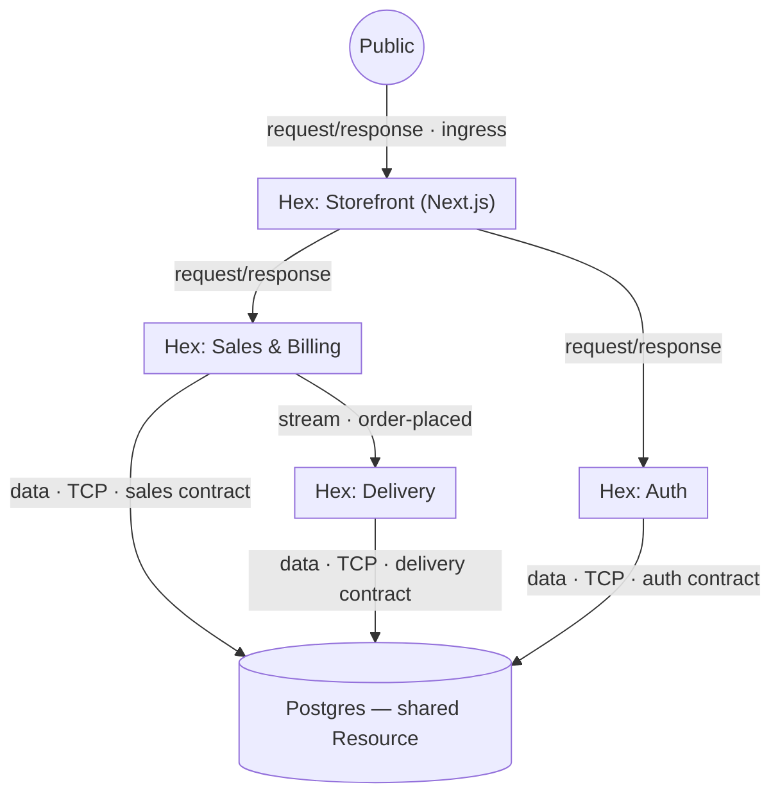

# Example app (anchor)

A fictional e-commerce app, used to keep design discussions concrete. It
exercises both connection styles (request/response and stream), a shared
Postgres carved by data contracts, and an external-flavoured auth dependency.

## The app

- A **website** (Next.js) — the public storefront.
- A **sales & billing** service — an internal HTTP API the website calls to record
  sales.
- A **delivery** subsystem — its own HTTP service; reacts to sales.
- **Auth** (BetterAuth-style) — owns auth tables, exposes an auth API.
- One **Postgres**, shared by the services (each owning its own slice).

## Decomposition into Hexes

> Naming reminder: the unit is a **Hex (Subsystem)**.

| Hex | Service(s) | Inputs | Outputs |
| --- | --- | --- | --- |
| **Storefront** | Next.js app | `sales` (request/response), `auth` (request/response) | `site` (request/response, **ingress** — public) |
| **Sales & Billing** | sales API | `data` (TCP + *sales* contract) | `sales` API (request/response), `order-placed` (stream) |
| **Delivery** | delivery API | `data` (TCP + *delivery* contract), `order-placed` (stream) | `delivery` API (request/response, internal) |
| **Auth** | auth service | `data` (TCP + *auth* contract) | `auth` API (request/response) |

Plus one shared **Resource**:

| Resource | Output |
| --- | --- |
| **Postgres** (shared) | `data` **Data Output** offering the contract hashes `{sales, delivery, auth}` — the **aggregate contract** |

## Topology

Arrows show request/data flow; labels give the connection.

## What the example demonstrates

- **Both connection styles.** Website → sales and website → auth are
  **request/response**; sales → delivery ("order placed") is a **stream**. Not
  everything is a stream.
- **The shared Postgres is carved by contracts.** Sales, delivery, and auth each
  hold their own Data Contract over the one Postgres. The Resource's Data Output
  must satisfy the **aggregate** of the three; ownership overlap is prohibited; the
  cloud can verify it. The instance is shared, but every data dependency is a
  visible edge — the topology doesn't hide coupling.
- **Ingress vs internal.** Only Storefront's `site` Output is public ingress; the
  sales/auth/delivery APIs are internal request/response Outputs consumed by other
  Hexes.
- **Encapsulation by convention.** No Hex reads another's tables; cross-Hex needs
  go through an Output (sales' API, the order-placed stream), never the database.
  This is the recommended convention, not (yet) an enforced rule.

## How it lowers (sketch)

Per `layering.md`: each Hex's Service → a Compute service (bundle + manifest); the
shared Postgres → one Database (Environment:Database is 1:1) whose schema is the
aggregate contract; the `order-placed` stream → a Stream; each request/response
edge → an endpoint + injected typed client; each Data Input → a contract-scoped
connection injected at runtime (no `DATABASE_URL` in user code). MakerKit emits
the whole graph as the topology artifact.

## Open questions / deferred

- Whether Delivery also needs a request/response Output at all, or is purely
  stream-driven — depends on the product.
- Auth as a **Hex** (owns its tables) vs an **external** request/response
  dependency (egress) — both are expressible; which BetterAuth fits is TBD.
- Connection-method richness (pooled, WebSocket) is deferred; the example uses
  `TCP` throughout.
