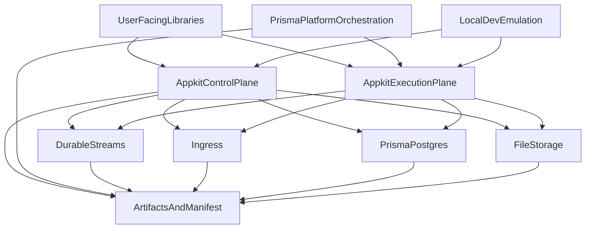

# Domain map

This is an evolving, high-level map of AppKit’s bounded contexts (domains) and their dependency direction.

## Draft domain map (WIP)

Notes:

- The exact boundaries are expected to evolve as we refine responsibilities.
- The key invariant we want to preserve is **dependency direction**: low-level primitives remain decoupled; composition happens in user-facing packages.
