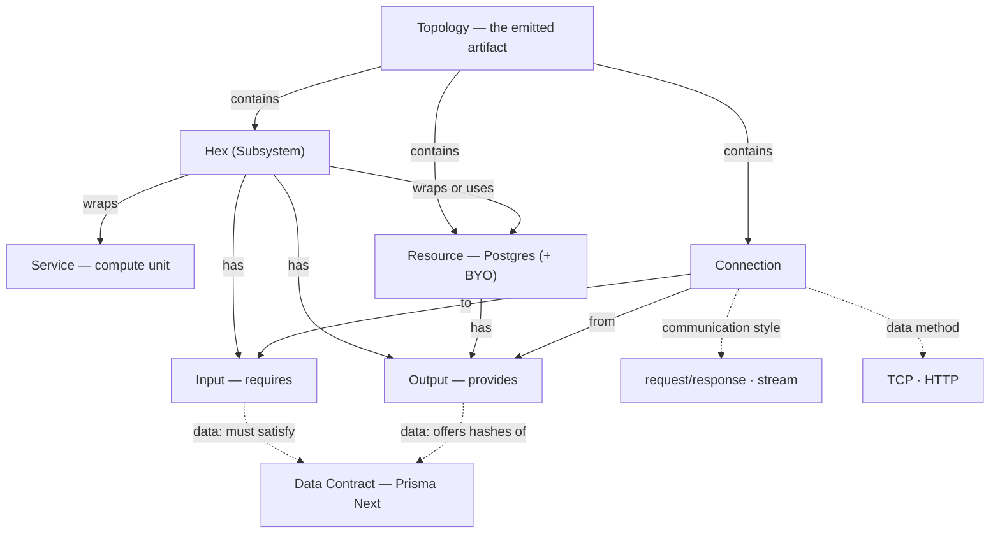

# Domain map

The conceptual map of MakerKit's **authoring plane** — the things a developer
models and how they relate. For how these lower to Alchemy and Prisma Cloud, see
`layering.md`; for definitions, see `glossary.md`.

(MakerKit's *own* internal architecture — its control/execution-plane contexts,
emitter, runtime — is a separate concern for the architecture phase, not this
map.)

## The meta-model

## How to read it

- **A Hex wraps Services and Resources** and is reachable from the outside *only*
  through its Inputs and Outputs. That boundary is what makes the topology
  truthful — every cross-Hex dependency is an edge.
- **Every node — Hex or Resource — can have Inputs and Outputs.** A connection
  always wires an Output to an Input.
- **Two families of connection:**
  - **communication** (Hex ↔ Hex, or public/external) with a **style**:
    `request/response` or `stream`. The style is a property of the connection; no
    Resource sits "in" it.
  - **data** (Hex → Postgres Resource) with a **method** (`TCP` / `HTTP`) and a
    **Data Contract**. The Postgres exposes a **Data Output** (the contract hashes
    it satisfies); the Hex's **Data Input** requires a contract; the wire is valid
    iff the offered hashes satisfy it.
- **The Topology is the artifact.** MakerKit infers the graph from TypeScript and
  emits it for the platform to provision.

## Dependency direction

The clean-architecture intent carries over: low-level Resources don't depend on
Hexes; Hexes depend on Resources and on each other's Outputs. Composition (the
wiring) is explicit and lives in the topology, not in ambient/global state.

## Open questions

- **Nesting** — Hexes can contain Hexes (subsystems). The exact rules for how a
  child Hex's Inputs/Outputs surface on its parent are not yet specified.
- **Resource placement** — a Resource may be owned inside one Hex (private) or
  stand alone and be shared by several Hexes' Data Inputs. "One owner" is a
  convention, not an enforced rule (see `glossary.md` → Deferred).
- **Stream attributes** — since a stream is a connection *style* and never a
  Resource node, attributes like retention and consumer groups would live on the
  connection. Where exactly is TBD.
