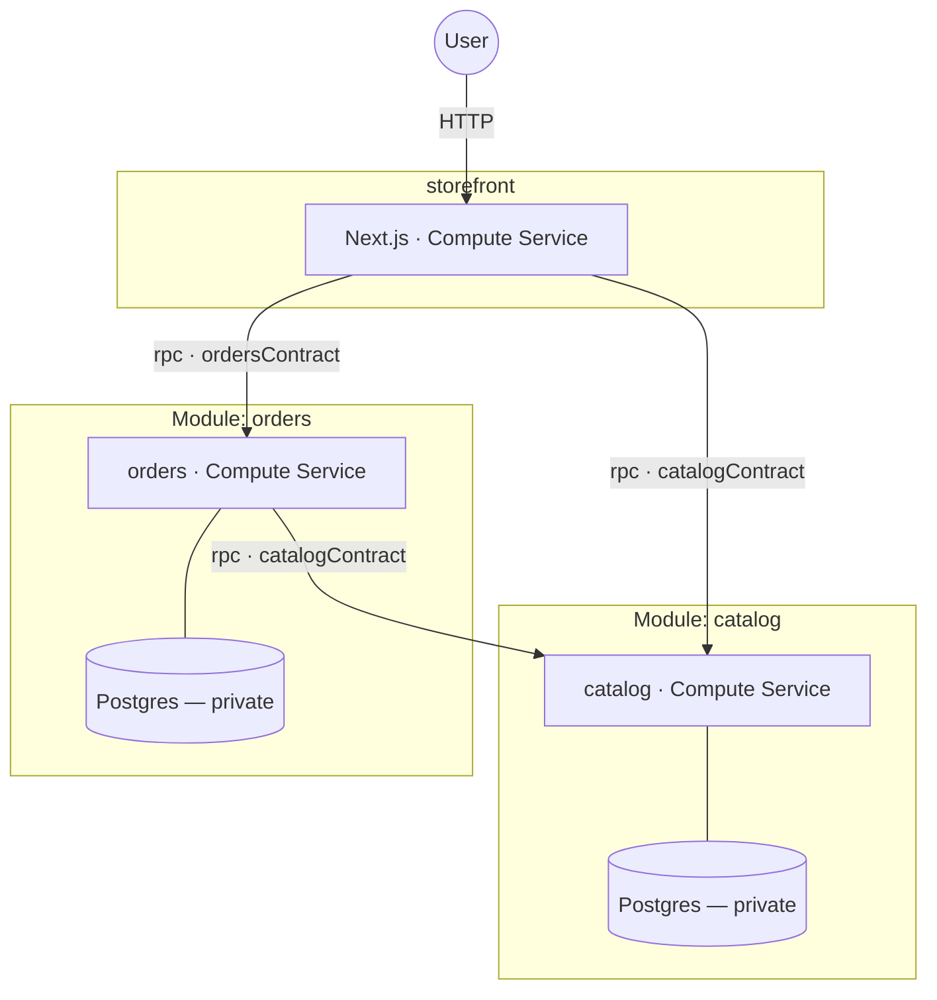

# store — Compose Coffee

A readable example Prisma App: a Next.js storefront, a **catalog** module, and
an **orders** module.



Each module owns its own Postgres; the only edges between components are the
typed RPC contracts. The whole composition is [module.ts](module.ts).

## What each piece shows

- [modules/catalog](modules/catalog) — a self-contained Module: a contract
  (`listProducts`/`getProduct`), a compute service, and a Postgres it owns and
  seeds. Consumers wire only the exposed `rpc` port.
- [modules/orders](modules/orders) — a Module with a **boundary input**: it
  owns its Postgres but declares `deps: { catalog }`, so whoever provisions it
  supplies a producer of `catalogContract`. `placeOrder` calls catalog to
  price the order at placement time.
- [modules/storefront](modules/storefront) — a real Next.js app. The page
  calls both typed clients; the Buy button is a server action that places an
  order.

## Run it locally (no cloud)

```sh
pnpm dev   # from examples/store
```

Serves in-memory fakes of catalog and orders on loopback ports and runs
`next dev` against them — the same fakes the unit test injects via
`mockService` ([page.test.tsx](modules/storefront/app/page.test.tsx)).

## Deploy

```sh
pnpm deploy    # needs .env at the repo root (see examples/storefront-auth)
pnpm destroy
```
